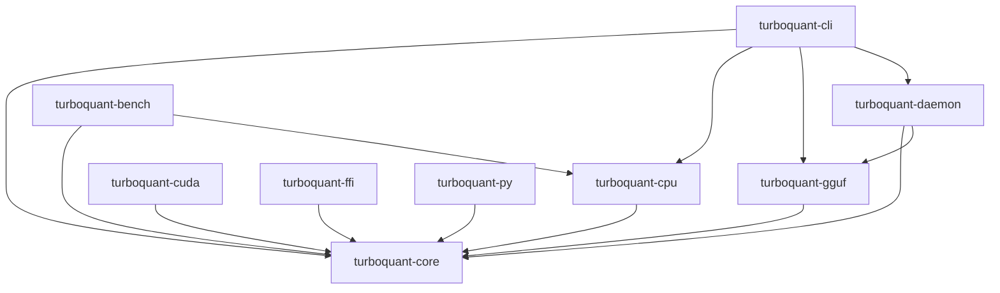

# TurboQuant Architecture

## Crate Dependency Graph

## Crate Responsibilities

### turboquant-core
- `bitpack.rs` — 3-bit packing (8 values → 3 bytes)
- `rotation.rs` — Orthogonal rotation trait + QR, Householder, Hadamard
- `qjl.rs` — QJL quantizer with configurable scale/correction
- `kv_block.rs` — Compressed KV cache storage
- `polar.rs` — PolarQuant wrapper around Rotation
- `quantize.rs` — Full compression pipeline + attention forward
- `error.rs` — Unified error type

### turboquant-cpu
- Parallel compression via rayon (no explicit SIMD; scalar code is
  auto-vectorized by LLVM)
- Benchmark helper functions

### turboquant-cuda
- Placeholder crate — **no GPU code is implemented**
- Reserves the API surface behind the (feature-gated, `cuda`) `cudarc`
  dependency for a future backend

### turboquant-gguf
- GGUF v2/v3 parsing, v3 writing
- "turbo3" compressed-model format v1 via `turboquant.*` metadata keys
  (see [GGUF.md](GGUF.md))
- Intended integration point for llama.cpp (which would need to
  implement the turbo3 spec to read compressed tensors)

### turboquant-cli
- CLI with clap derive
- 7 subcommands: compress, verify, bench, calibrate, audit, info, daemon
- Colored output

### turboquant-daemon
- systemd `Type=notify` service (readiness via `sd_notify`); honors the
  unit watchdog (`WatchdogSec=`) by sending `WATCHDOG=1` keepalives at
  half the configured interval when systemd arms one
- Filesystem watcher (notify) that auto-compresses new `.gguf` files
- Health endpoint `GET /healthz` on `127.0.0.1:7460` (default)
- `tracing`-based logging; JSON config file

### turboquant-ffi
- C ABI via `cbindgen`
- Functions: `tq_quantizer_create`/`tq_quantizer_destroy`,
  `tq_quantize`, `tq_dequantize`, plus buffer-sizing helpers
  (see [FFI.md](FFI.md))

### turboquant-py
- Python bindings via pyo3 (module name `turboquant`, built with maturin)
- Exposes `Quantizer`, `pack_3bit`/`unpack_3bit`, `hadamard_rotate`
  (see [FFI.md](FFI.md))

### turboquant-bench
- Criterion benchmarks
- Compression, rotation, attention comparisons

## Extension Points

- `Rotation` (trait) — implement new orthogonal transforms
- `ScaleMode` (enum) — absmax, percentile, adaptive, fixed; new modes are
  added as variants in `turboquant-core`
- New hardware backends (CUDA, Metal, ROCm, WebGPU) would slot in as
  sibling crates over `turboquant-core`; there is no `Backend` trait yet
