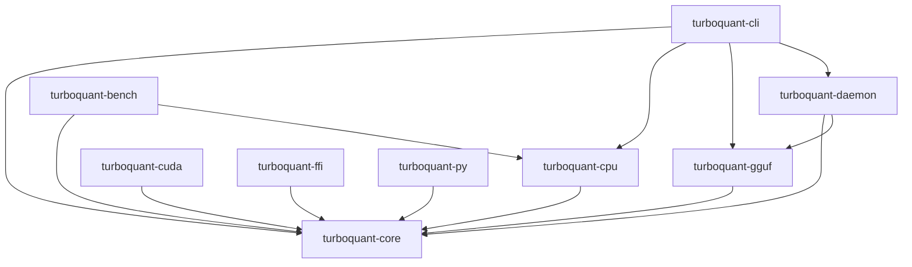

# TurboQuant Architecture

## Crate Dependency Graph

## Crate Responsibilities

### turboquant-core
- `bitpack.rs` — 3-bit packing (8 values → 3 bytes)
- `rotation.rs` — Orthogonal rotation trait + QR, Householder, Hadamard
- `qjl.rs` — QJL quantizer with configurable scale/correction
- `kv_block.rs` — Compressed KV cache storage
- `polar.rs` — PolarQuant wrapper around Rotation
- `quantize.rs` — Full compression pipeline + attention forward
- `error.rs` — Unified error type

### turboquant-cpu
- Parallel compression via rayon
- SIMD acceleration via `wide` crate
- Benchmark helper functions

### turboquant-cuda
- Feature-gated (`cuda` feature)
- CUDA kernels via `cudarc`
- GPU rotation, quantization, attention

### turboquant-gguf
- GGUF format parsing
- Writer with `cache-type: turbo3` metadata
- Integration point for llama.cpp

### turboquant-cli
- CLI with clap derive
- 7 subcommands
- Progress bars, colored output

### turboquant-daemon
- systemd watchdog service
- Filesystem watcher (notify)
- HTTP API on `127.0.0.1:7460`
- Structured JSON logging

### turboquant-ffi
- C ABI via `cbindgen`
- Functions: `tq_compress`, `tq_decompress`, `tq_attention_forward`

### turboquant-py
- Python bindings via pyo3
- Drop-in compatibility with `legacy/python/turboquant.py`

### turboquant-bench
- Criterion benchmarks
- Compression, rotation, attention comparisons

## Extension Points

All core algorithms expose traits for custom implementations:

- `Rotation` — implement new orthogonal transforms
- Custom `ScaleMode` — override scale computation
- `Backend` — target new hardware (Metal, ROCm, WebGPU)
